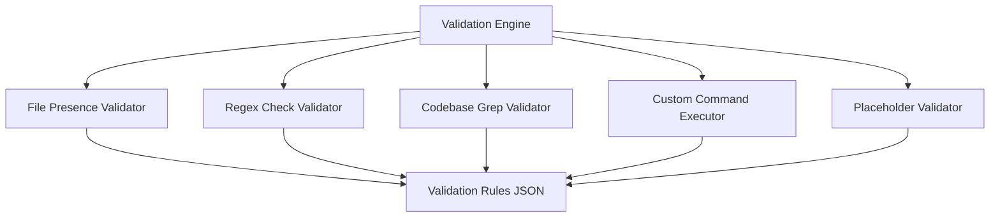
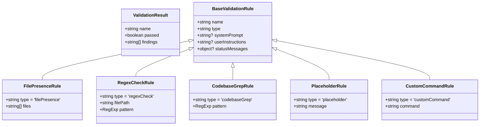
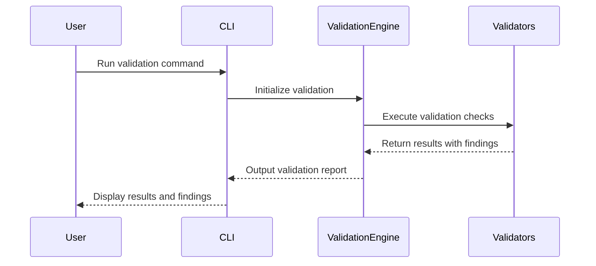

# Watchman AI - Command-Line Validation Tool

## Overview
The Watchman AI Command-Line Validation Tool is designed to enforce rules, specifications, and standards in AI coding environments. It accepts a set of validation criteria and returns a comprehensive validation report.

## Features
- Accepts validation criteria via command-line arguments or configuration files.
- Processes criteria using the Agno framework.
- Generates detailed validation reports with errors and warnings.
- Collects specific findings during validation for better diagnostics.
- Supports multiple validation rule types for comprehensive checks.

## Setup Instructions
1. **Install Dependencies:**
   ```bash
   npm install
   ```

2. **Build the Project:**
   ```bash
   npm run build
   ```

## Usage Guidelines
- **Run the Tool:**
  ```bash
  npm run dev -- [options]
  ```
  Replace `[options]` with the desired validation criteria.

## Validation Rules

The system supports the following validation rule types:

1. **File Presence Rule**: Checks if specified files exist in the project.
2. **Regex Check Rule**: Checks if a regex pattern exists in a specific file.
3. **Codebase Grep Rule**: Searches for a regex pattern across the entire codebase.
4. **Placeholder Rule**: A placeholder for future validation rules.
5. **Custom Command Rule**: Executes a custom shell command for validation.

Each validation rule can collect specific findings during validation, providing detailed information about why a validation failed and what needs to be fixed.

## Architecture



## Class Diagram



## Validation Flow



## Future Plans
- Expand into an MCP server, VS Code plugin, or daemon for real-time validation.
- Enhance scalability to handle large sets of validation criteria.

## License
This project is licensed under the MIT License.

## Contact
For questions or feedback, please contact Andrew Hopper at hopperab@gmail.com.
